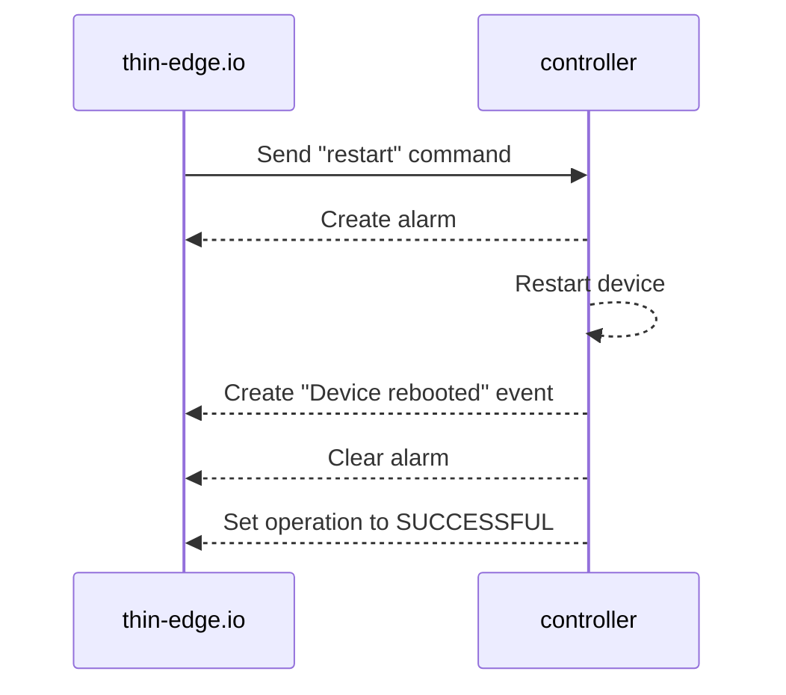
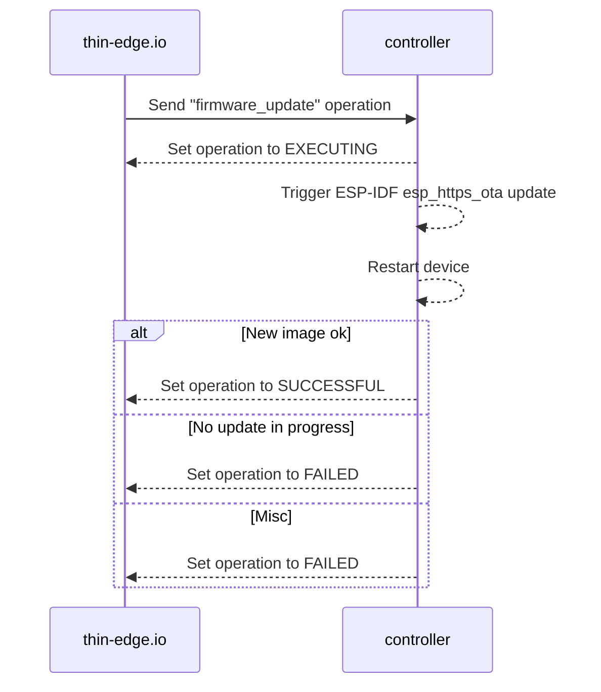

## Command

The client supports the following commands, and their sequence diagram are listed below.

### Restart device

Trigger a device restart.

### Firmware update

Update the firmware/application running on the device by downloading a new image. The process is similar to an A/B update where there are two application slots, and the non-active partition receives the new image, then the device reboots into the new image. The new application will be verified if it is ok, and commit to the current application, otherwise rollback to the previous partition (which will require an additional restart).

